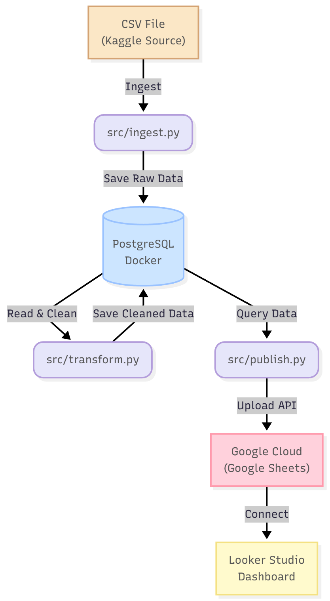

# 🚀 End-to-End Sales Data Pipeline & Dashboard Project

โปรเจคนี้เป็นส่วนหนึ่งของวิชา Big Data Processing and Analytics (AIE321) โดยมีวัตถุประสงค์เพื่อสร้าง **Automated Data Pipeline** (กระบวนการจัดการข้อมูลอัตโนมัติ) ตั้งแต่การนำเข้าข้อมูลดิบจาก Kaggle, การจัดเก็บลงฐานข้อมูล, การแปลงข้อมูล, ไปจนถึงการแสดงผลบน Dashboard เพื่อตอบโจทย์ทางธุรกิจ

## 📋 Project Overview

**Source Dataset:** [100,000 Sales Records (Kaggle)](https://www.kaggle.com/datasets/okhiriadaveoseghale/100000-sales-records)

ข้อมูลชุดนี้คือ "ข้อมูลการขายสินค้า" (Sales Records) โดยเก็บข้อมูลธุรกรรมการขายจริง 100,000 รายการ ตั้งแต่ปี 2010–2017 ทั้งจากหลายภูมิภาค หลายประเทศ หลายช่องทางขาย เช่น Online, Offline มีรายละเอียดแต่ละออเดอร์ เช่น ประเภทสินค้า, ประเทศ, เขต, ช่องทางจำหน่าย, วันที่สั่งซื้อ, จำนวนชิ้น, ราคาต่อหน่วย, กำไร เป็นต้น เหมาะสำหรับการฝึกวิเคราะห์ข้อมูล ข้อมูลธุรกิจ การวิเคราะห์ตลาด และการคาดการณ์ยอดขายในอุตสาหกรรมค้าปลีก

### 📌 Business Questions
Dashboard ของเราถูกออกแบบมาเพื่อตอบคำถามสำคัญ 5 ข้อ ได้แก่
1. **สินค้าประเภทใด (Item Type) มียอดขายรวมและกำไรสูงสุดตลอดช่วงปี 2010-2017?**
2. **ประเทศใด (Country) มียอดขายมากที่สุด?**
3. **ช่องทางการขายแบบใด (Online/Offline) ทำกำไรรวมสูงสุด?**
4. **ประเทศใดมียอดขายเฉลี่ยสูงที่สุดตลอดช่วงเวลา 2010–2017?**
5. **ระยะเวลาตั้งแต่ซื้อจนถึงจัดส่ง (Order Date - Ship Date) ส่งผลต่อยอดขาย (Total Revenue)
หรือไม่?**

---

### 🛠️ Architecture & Tech Stack



* **Source:** CSV File (Kaggle Dataset)
* **Language:** Python 3.9+
* **Containerization:** Docker & Docker Compose
* **Database:** PostgreSQL (Run on Docker)
* **Cloud & Storage:** Google Sheets (บน Google Cloud Platform)
* **Libraries:**
    * `pandas` (Data Manipulation)
    * `sqlalchemy` / `psycopg2` (Database Connection)
    * `gspread` / `oauth2client` (Google Sheets API)
* **Visualization:** Google Looker Studio

---

### 📂 Project Structure

```text
.
├── images/                 # โฟลเดอร์เก็บรูปภาพ
├── data/                   # โฟลเดอร์เก็บไฟล์ CSV (Source)
│   └── 100000 Sales Records.csv
├── src/
│   ├── ingest.py           # Step 1: สคริปต์นำเข้าข้อมูลลง Database
│   ├── transform.py        # Step 2: สคริปต์ทำความสะอาดและแปลงข้อมูล
│   ├── publish.py          # Step 3: สคริปต์ส่งข้อมูลขึ้น Google Sheets
│   └── run_pipeline.py     # Main Script สำหรับสั่งรันทุกขั้นตอน
├── .gitignore
├── docker-compose.yml
├── README.md
└── requirements.txt
```

---

### ⚙️ Setup & Usage

ส่วนนี้จะอธิบายขั้นตอนอย่างละเอียดในการรันโปรเจคบนเครื่อง Local (Computer ของคุณ)

### 1. Prerequisites
ก่อนเริ่มใช้งาน ต้องติดตั้งโปรแกรมเหล่านี้ในเครื่องก่อน:
* **[Docker Desktop](https://www.docker.com/products/docker-desktop/)**: สำหรับจำลอง Database
* **[Python 3.9+](https://www.python.org/downloads/)**: ภาษาหลักที่ใช้เขียนโค้ด
* **[Git](https://git-scm.com/downloads)**: สำหรับจัดการเวอร์ชันโค้ด
---
### 2. เตรียมโปรเจค (Setup Project)

**Step 2.1: Clone Repository**
เปิด Terminal (หรือ CMD/PowerShell) แล้วพิมพ์คำสั่งดังนี้:
```bash
git clone [ใส่ลิงก์ GitHub ของคุณตรงนี้]
cd [ชื่อโฟลเดอร์โปรเจค]
```


**Step 2.2: ตั้งค่า Google Credentials**
1. เตรียมไฟล์ `credentials.json` (ที่ได้จากการสร้าง Service Account ใน Google Cloud Console)
2. นำมาวางไว้ที่ **Root Directory** (โฟลเดอร์นอกสุด ชั้นเดียวกับไฟล์ `run_pipeline.py`)
3. **สำคัญ:** อย่าลืมกด Share ไฟล์ Google Sheets ปลายทาง ให้กับอีเมลของ Service Account (`client_email` ในไฟล์ JSON)
---

### 3. ตั้งค่าสภาพแวดล้อม (Environment Setup)

**Step 3.1: สร้าง Virtual Environment**
เพื่อแยก Library ของโปรเจคนี้ออกจากโปรเจคอื่นในเครื่อง

*สำหรับ Windows:*
```bash
python -m venv venv
venv\Scripts\activate
```
*สำหรับ Mac / Linux:*
```Bash
python3 -m venv venv
source venv/bin/activate
```
**Step 3.2: ติดตั้ง Libraries**
```bash
pip install -r requirements.txt
```
---

### 4. รันฐานข้อมูล (Launch Database)

**Step 4.1: Docker Compose** เพื่อสร้าง PostgreSQL Database ขึ้นมา
```bash
docker-compose up -d
```
**Step 4.2: เริ่มรัน Pipeline (Execution)**
```bash
cd src
python run_pipeline.py
```


### สิ่งที่จะเกิดขึ้นระหว่างการรัน:

- ⏳ **Step 1: Ingestion**  
  โหลดข้อมูล CSV เข้า Database  
  Output: `Successfully loaded 100000 records to Database.`

- ⏳ **Step 2: Transformation**  
  คำนวณยอดขายและกำไร  
  Output: `Data transformation complete. Summary dataframe created.`

- ⏳ **Step 3: Publish**  
  อัปโหลดข้อมูลไป Google Sheets  
  Output: `Successfully uploaded data to Google Sheets.`

✅ เสร็จสิ้น สามารถตรวจสอบผลลัพธ์ได้ที่: `Google Sheets`, `Looker Studio`


---
### 📊 Dashboard Showcase

👉 **Looker Studio Dashboard:** [100,000 Sales Records](https://lookerstudio.google.com/u/0/reporting/a1ca0ea0-2643-40ac-81f7-a1a20937cd24/page/JGqgF) 


---

### 👥 Team Members
| Student ID  | Name                      | GitHub                          |
|:-----------:|:-------------------------:|:--------------------------------:|
| 1660903640  | Ms. Lalitawadee Wongkhun       | [miyomui](https://github.com/miyomui)      |
| 1660904226  | Ms. Jeeranan Sena             | [Granxn](https://github.com/Granxn)       |
| 1660902741  | Mr. Sutivat Thiwatkhanawan   | [sutivat](https://github.com/sutivat)      |
